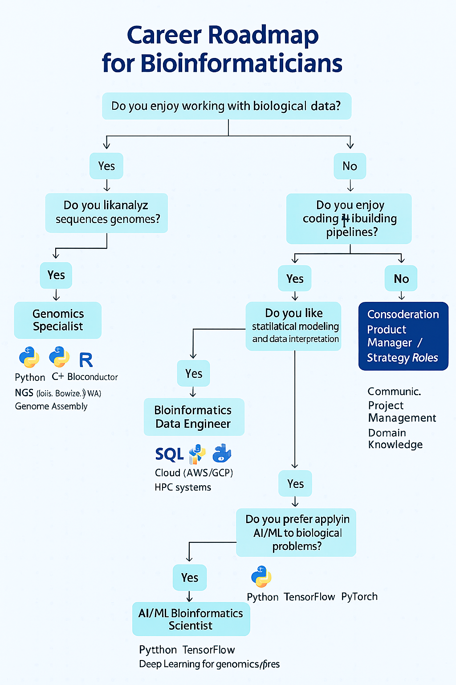

# Career Trajectory for a Bioinformatician

This document outlines a potential career trajectory for a bioinformatician, from entry-level positions to senior leadership roles. It describes typical roles, responsibilities, required skills, and potential career advancements within the field. This trajectory serves as a guide and may vary depending on individual interests, skills, and the specific organization.

## Entry-Level Positions

### 1. Bioinformatics Intern/Research Assistant

Responsibilities:
- Assisting senior bioinformaticians with data analysis.
- Performing basic bioinformatics tasks such as sequence alignment, database searching, and data mining.
- Writing and maintaining scripts for data processing.
- Contributing to research projects by analyzing genomic, transcriptomic, or proteomic data.

- Documenting methods and results.

*Skills Required:*

- Basic understanding of molecular biology and genetics.

- Familiarity with bioinformatics tools and databases (e.g., BLAST, NCBI, Ensembl).

- Proficiency in at least one scripting language (e.g., Python, R).

- Basic knowledge of statistical analysis.

- Good communication and teamwork skills.

- Education: Bachelor's degree in bioinformatics, computer science, biology, or a related field.

### 2. Bioinformatics Analyst I

Responsibilities:

Analyzing biological data using bioinformatics tools and pipelines.

Developing and implementing new bioinformatics methods.

Interpreting results and generating reports.

Collaborating with biologists and other scientists to design experiments and analyze data.

Maintaining and updating bioinformatics databases and software.

Skills Required:

Strong understanding of molecular biology, genetics, and genomics.

Proficiency in bioinformatics tools and databases.

Expertise in scripting languages (e.g., Python, R, Perl).

Knowledge of statistical analysis and data visualization.

Experience with high-performance computing environments.

Education: Bachelor's or Master's degree in bioinformatics, computer science, biology, or a related field.

## Mid-Level Positions

### 3. Bioinformatics Analyst II/Scientist I

Responsibilities:

Leading bioinformatics projects and providing guidance to junior analysts.

Developing and implementing advanced bioinformatics methods and pipelines.

Analyzing complex biological datasets and interpreting results.

Writing scientific publications and presenting research findings at conferences.

Contributing to grant proposals and other funding applications.

Skills Required:

Advanced knowledge of molecular biology, genetics, and genomics.

Expertise in bioinformatics tools, databases, and algorithms.

Strong programming skills in multiple languages (e.g., Python, R, C++).

Experience with machine learning and data mining techniques.

Excellent communication, leadership, and project management skills.

Education: Master's or Ph.D. in bioinformatics, computer science, biology, or a related field.

### 4. Bioinformatics Specialist/Data Scientist

Responsibilities:

Focusing on specific areas of bioinformatics, such as genomics, proteomics, or drug discovery.

Developing and implementing specialized bioinformatics tools and pipelines.

Providing expert advice and support to researchers in their area of expertise.

Staying up-to-date with the latest advances in bioinformatics and related fields.

Contributing to the development of new bioinformatics technologies.

Skills Required:

In-depth knowledge of a specific area of bioinformatics.

Expertise in specialized bioinformatics tools and databases.

Strong programming and data analysis skills.

Excellent problem-solving and critical-thinking skills.

Ability to work independently and as part of a team.

Education: Master's or Ph.D. in bioinformatics, computer science, biology, or a related field.

## Senior-Level Positions

### 5. Senior Bioinformatics Scientist/Team Lead

Responsibilities:

Leading a team of bioinformaticians and providing technical guidance.

Designing and implementing bioinformatics strategies for research projects.

Managing bioinformatics resources and infrastructure.

Collaborating with other research groups and departments.

Mentoring junior bioinformaticians and providing training.

Skills Required:

Extensive knowledge of bioinformatics principles and practices.

Strong leadership and management skills.

Excellent communication and interpersonal skills.

Ability to manage multiple projects and priorities.

Experience with budget management and resource allocation.

Education: Ph.D. in bioinformatics, computer science, biology, or a related field.

### 6. Bioinformatics Manager/Director

Responsibilities:

Overseeing all bioinformatics activities within an organization.

Developing and implementing bioinformatics strategies and policies.

Managing a team of bioinformaticians and providing leadership.

Collaborating with senior management to align bioinformatics goals with organizational objectives.

Ensuring the quality and integrity of bioinformatics data and analyses.

Skills Required:

Extensive experience in bioinformatics and related fields.

Strong leadership, management, and communication skills.

Ability to think strategically and develop long-term plans.

Experience with budget management, resource allocation, and project management.

Knowledge of regulatory requirements and ethical considerations.

Education: Ph.D. in bioinformatics, computer science, biology, or a related field.

### 7. Principal Scientist/Bioinformatics Fellow

Responsibilities:

Leading cutting-edge bioinformatics research projects.

Developing and implementing innovative bioinformatics methods and technologies.

Publishing high-impact scientific papers and presenting research findings at international conferences.

Serving as a recognized expert in bioinformatics.

Mentoring junior scientists and providing guidance.

Skills Required:

Exceptional knowledge of bioinformatics principles and practices.

Proven track record of scientific achievement.

Strong leadership and communication skills.

Ability to think creatively and solve complex problems.

Extensive network of contacts in the bioinformatics community.

Education: Ph.D. in bioinformatics, computer science, biology, or a related field.

## Executive-Level Positions

### 8. Vice President/Chief Bioinformatics Officer

Responsibilities:

Providing strategic leadership and direction for all bioinformatics activities within an organization.

Developing and implementing bioinformatics strategies that support the organization's overall goals.

Managing a large team of bioinformaticians and other scientists.

Collaborating with senior management to make strategic decisions.

Representing the organization at industry events and conferences.

Skills Required:

Extensive experience in bioinformatics and related fields.

Exceptional leadership, management, and communication skills.

Ability to think strategically and develop long-term plans.

Experience with budget management, resource allocation, and project management.

Strong understanding of the business environment and competitive landscape.

Education: Ph.D. in bioinformatics, computer science, biology, or a related field. MBA is a plus.

This career trajectory provides a general overview of the potential career paths for a bioinformatician. The specific roles and responsibilities may vary depending on the organization and the individual's skills and interests. Continuous learning and professional development are essential for success in this rapidly evolving field.