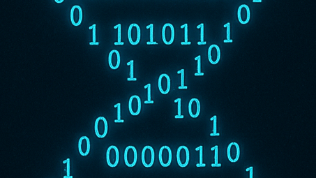

**জেমস ওয়াটসন, ডিএনএ ও কম্পিউটেশনাল বায়োলজি : ডাবল হেলিক্স থেকে বায়োইনফরমেটিক্সের জন্ম**

   
  *ছবিঃ জেমস ওয়াটসন*

**🧬 এক যুগের সমাপ্তি, এক নতুন দিগন্তের শুরু**

সকালে উঠেই দেখি **জেমস ডি. ওয়াটসন** প্রয়াত — এমন এক নাম যাকে ছাড়া আধুনিক জীববিজ্ঞান কল্পনাই করা যায় না। আমার বর্তমান ক্যারিয়ারতো নয়ই! গত ১২ বছর তো আমি বিভিন্ন উদ্ভিদ ও প্রাণীর ডিএনএ, আরএনএ, প্রোটিন সিকোয়েন্স এনালাইসিস ও গবেষণা নিয়েই মজে আছি!

 ১৯৫৩ সালে ফ্রান্সিস ক্রিক-এর সঙ্গে যৌথভাবে তাঁর প্রকাশিত ডিএনএ ডাবল হেলিক্স মডেল শুধু এক গঠনগত আবিষ্কার ছিল না; এটি ছিল জীবনের শারীরিক মূলতত্ত্বকে তথ্যতাত্ত্বিকভাবে বোঝার সূচনা। এতে রোজালিন ফ্রাঙ্কলিনের অবদানও ছিল অসামান্য।

আমাদের, বায়োইনফরমেটিশিয়ানদের কাছে, এই আবিষ্কার ছিল **“Life’s first algorithm”** — এমন এক কাঠামো যা জীবনের কোডকে কম্পিউটেশনালভাবে বিশ্লেষণযোগ্য করে তোলে।

**🧬 ডিএনএ: জীবনের প্রথম তথ্যসংকেত**
 
  *ছবিঃ ডিএনএ (প্রতীকী ছবি)*

ওয়াটসন ও ক্রিক প্রথম দেখিয়েছিলেন — জীবের উত্তরাধিকার রসায়নের নয়, বরং তথ্যের শৃঙ্খল।
চারটি বেস (A, T, G, C) এর ধারাবাহিকতা যে কোনো জীবের শারীরিক পূর্ণ নির্দেশনামালা — এবং এই ক্রমই পরবর্তীতে ডিজিটাল রূপে প্রকাশযোগ্য তথ্য হিসেবে প্রতিষ্ঠিত হয়। আল্লাহর সৃষ্টি দেখে অবাক হয়ে যাই! সুব'হানাল্লাহ!!

এই ধারণাই ভবিষ্যতের বায়োইনফরমেটিক্সের বীজ বপন করে।
আজ আমরা জানি:

>ডিএনএ হলো জীবনের সোর্স কোড, আর বায়োইনফরমেটিক্স তার কম্পাইলার।

**🧬 ডাবল হেলিক্স থেকে ডেটা স্ট্রাকচার**

১. সিকোয়েন্সিং ও অ্যালগরিদমিক পুনর্গঠন

ডিএনএ-র একটি স্ট্র্যান্ড অন্যটির টেমপ্লেট হিসেবে কাজ করতে পারে — এই ধারণা থেকেই জন্ম সিকোয়েন্স অ্যাসেম্বলি অ্যালগরিদমের।
আজকের SPAdes, Canu, Flye বা HiFi-ভিত্তিক অ্যাসেম্বলারগুলো আসলে Watson–Crick-এর “complementarity” নীতিরই গাণিতিক পুনর্লিখন।

২. গঠনবিজ্ঞান থেকে স্ট্রাকচারাল ইনফরমেটিক্স

ডিএনএ-র ত্রি-মাত্রিক গঠন জানার মধ্য দিয়েই শুরু হয়েছিল স্ট্রাকচারাল বায়োইনফরমেটিক্স।
বর্তমানে AlphaFold2, RoseTTAFold, ESMFold ইত্যাদি ডিপ লার্নিং মডেল আমাদের ডিএনএ-প্রোটিন ইন্টারঅ্যাকশন পূর্বাভাস দিতে সাহায্য করে।

ওয়াটসনের সেই কাগজের মডেলগুলো আজ রূপ নিয়েছে পেটাবাইট পরিমাণ ডেটাভিত্তিক সিমুলেশনে।

৩. জিনোমিক ডেটার জন্ম

হিউম্যান জিনোম প্রজেক্ট (১৯৯০–২০০৩) ছিল ওয়াটসনের নেতৃত্বে জীববিজ্ঞানের ইতিহাসে প্রথম “বিগ ডেটা” প্রকল্প।
মানব জিনোমের ৩ বিলিয়ন বেস-পেয়ার ছিল এক বিশাল ডেটা ম্যাট্রিক্স, যার বিশ্লেষণ ছাড়া অর্থ নির্ণয় অসম্ভব ছিল।
এই চ্যালেঞ্জই জন্ম দেয় বায়োইনফরমেটিক্স নামক নতুন শাস্ত্রের।

>আজকের মাল্টি-ওমিক্স যুগ — genomics, transcriptomics, proteomics, metabolomics — সবই সেই পথের সম্প্রসারণ।

৪. তথ্যতত্ত্ব ও জীবনের অ্যালগরিদমিক প্রকৃতি

ক্লড শ্যাননের তথ্যতত্ত্ব ও ডাবল হেলিক্স একই ধারণার দুই রূপ:
>একটি বলে “তথ্য কীভাবে স্থানান্তরিত হয়”, অন্যটি বলে “জীবনে সেটি কীভাবে রূপান্তরিত হয়”।

আমরা এখন Shannon entropy, mutual information, এবং graph-based neural models ব্যবহার করে জিনোমিক তথ্যের গভীর সম্পর্ক বিশ্লেষণ করি। ডিএনএ এখন এক কম্পিউটেবল তথ্যবস্তু (computable entity)।

**⚗️ NGS ও HTS বিশ্লেষণ: ওয়াটসনের উত্তরাধিকার ডেটা-যুগে**

ওয়াটসনের সময়ে ডিএনএ কে পড়ার একমাত্র পদ্ধতি ছিল Sanger sequencing — ধীর, শ্রমসাধ্য, ও সীমিত স্কেলে কার্যকর।
কিন্তু আজ আমরা দাঁড়িয়ে আছি Next Generation Sequencing (NGS) এবং High Throughput Sequencing (HTS)-এর যুগে, যেখানে কয়েক ঘন্টার মধ্যে লক্ষ লক্ষ ডিএনএ ফ্র্যাগমেন্ট থেকে সম্পূর্ণ জিনোম পুনর্গঠন সম্ভব।

এই প্রযুক্তি আসলে ওয়াটসনের প্রস্তাবিত “complementary base pairing” ধারণার এক বিশাল প্রযুক্তিগত রূপান্তর।
প্রতিটি রিড, প্রতিটি বেস, প্রতিটি সিগন্যাল ডেটা হিসেবে ধরা পড়ে — আর বায়োইনফরমেটিক্স হলো সেই ডেটাকে অর্থে রূপান্তরিত করার বিজ্ঞান।

**HTS ডেটা প্রক্রিয়াকরণে মূল ধাপগুলো**

১. Quality Control (QC):
FastQC, MultiQC-এর মতো টুলস দিয়ে সিকোয়েন্স রিডের মান যাচাই করা।

২. Alignment বা Mapping:
BWA, Bowtie2, HISAT2, Salmon ইত্যাদি tool দিয়ে রিডগুলোকে রেফারেন্স জিনোমের সঙ্গে মিলিয়ে দেখা।

৩. Variant Calling:
GATK, FreeBayes, DeepVariant ইত্যাদি টুল দিয়ে সনাক্ত করা — কোন বেসের পরিবর্তন কোথায় হয়েছে।
৪. Annotation ও Functional Analysis:
ANNOVAR, VEP, SnpEff ব্যবহার করে নির্ধারণ করা হয় কোন জিন বা পথ (pathway) প্রভাবিত হয়েছে।

এই প্রতিটি ধাপই ওয়াটসনের “DNA as information” ধারণাকে বাস্তবায়িত করে — *প্রতিটি বেসকে ডেটা হিসেবে, প্রতিটি পরিবর্তনকে ইনফরমেশন ইভেন্ট* হিসেবে গণ্য করে।

**মাল্টি-ওমিক্স ও সিস্টেম লেভেল ইন্টিগ্রেশন**

NGS এখন আর শুধু জিনোম পড়তে সীমাবদ্ধ নয়।
RNA-seq, ATAC-seq, ChIP-seq, Metagenomics, এবং Single-cell sequencing — এইসব প্রযুক্তি জীববিজ্ঞানের প্রতিটি স্তরে তথ্য সংগ্রহ করছে।
HTS ডেটা বিশ্লেষণ এখন বায়োইনফরমেটিক্সের হৃদয় — যেখানে অ্যালগরিদম, মেশিন লার্নিং, ও পরিসংখ্যান একত্রে কাজ করে জীবনের অদৃশ্য নেটওয়ার্ক উন্মোচন করতে।

*ওয়াটসন থেকে ওয়ার্কফ্লো*

যদি ১৯৫৩ সালে ডিএনএ গঠন ছিল বিজ্ঞানের মডেলিং, তবে ২০২৫ সালে NGS বিশ্লেষণ হলো জীবনের পুনরাবিষ্কার।
আজকের HTS পাইপলাইনগুলো — Snakemake, Nextflow, Galaxy — আসলে ওয়াটসনের আবিষ্কৃত তথ্যগঠনের উপর নির্মিত computational workflows of life।

>ডাবল হেলিক্স ছিল সূত্র, আর NGS বিশ্লেষণ হলো তার ডেটা অনুবাদ।

**🤖 ডিপ লার্নিং যুগে ডাবল হেলিক্সের পুনর্জন্ম**

১৯৫৩ সালে ওয়াটসন ও ক্রিক কাঠের 'বল-বন্ড' মডেলে জীবনের গঠন বুঝিয়েছিলেন।
২০২৫ সালে আমরা Transformer নিউরাল নেটওয়ার্ক দিয়ে ডিএনএ মিথাইলেশন, ক্রোমাটিন কনফিগারেশন, এমনকি বিবর্তনীয় পরিবর্তন পূর্বাভাস দিই।

এক অর্থে,

>তারা মডেল বানিয়েছিলেন পদার্থ দিয়ে, আমরা বানাই ডেটা দিয়ে।

**নৈতিকতা ও মানবিক মূল্যবোধ**

ওয়াটসনের পরবর্তী জীবনে কিছু বিতর্কিত মন্তব্য তাঁর ব্যক্তিগত ভাবমূর্তি ক্ষুণ্ণ করেছিল, কিন্তু বিজ্ঞানী হিসেবে তাঁর অবদান অনস্বীকার্য।
বায়োইনফরমেটিক্সের জন্য এটি এক স্মারক বার্তা — জিনোম ডাটাগুলো সব মানুষের জন্য, এর গবেষণা হতে হবে নৈতিক, অন্তর্ভুক্তিমূলক ও মানবমুখী।

**🔬 জীবনের কোড থেকে কৃত্রিম বুদ্ধিমত্তা**

ওয়াটসনের ডাবল হেলিক্স শুধু জীববিজ্ঞানের ভিত্তি নয়; এটি বায়োইনফরমেটিক্সের জন্মলগ্নের মূল।
প্রতিটি সিকোয়েন্স এলাইনমেন্ট, প্রতিটি জিনোম অ্যানোটেশন, প্রতিটি ডিপ লার্নিং প্রেডিকশন — সবই সেই ধারণারই সম্প্রসারণ।

তিনি দেখিয়েছিলেন,
জীবনকে অ্যালগরিদমে রূপান্তর করা যায়।
আমরা এখন সেই অ্যালগরিদমকে বিশ্লেষণ করছি, রূপান্তর করছি, এবং একদিন হয়তো পুনর্লিখনও করব।

ডিএনএ ছিল জীবনের প্রথম কোড।
ওয়াটসন সেই কোডের ভাষা উদ্ঘাটন করেছিলেন।
আর আজ আমরা, বায়োইনফরমেটিশিয়ানরা, সেই ভাষার সিনট্যাক্স ও সেমান্টিকস বিশ্লেষণ করছি — জীবনের অর্থ খুঁজে বের করার নতুন উপায় অবলম্বন করে।

>ডাবল হেলিক্স কোনো সমাপ্তি নয়; এটি ছিল এক অন্তহীন সূচনা।

*পরিমার্জন ও পরিবর্ধনেঃ AI, ChatGPT*

------------------
লেখক: ড. আবু বকর ছিদ্দিক  
পদবী: জৈব তথ্য বিশ্লেষক, গবেষক ও শিক্ষক,   সুইডিশ কৃষি বিশ্ববিদ্যালয় (SLU), উপসালা, সুইডেন  
প্রকাশকাল: ০৮-১১-২০২৫
