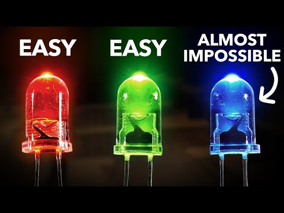

### নীল আলো খুঁজে পাওয়া মানুষটি – শূজি নাকামুরার গল্প

  

  <em>ছবিঃ তিন ধরনের এলইডি</em>

নীল রং মানুষের মনে সবসময় এক ধরনের বিস্ময় জাগায়। আকাশ, সমুদ্র, দূরের কুয়াশা—যেখানেই তাকানো যায়, নীল যেন প্রকৃতির সবচেয়ে প্রাচীন ভাষা। কিন্তু আশ্চর্যের বিষয় হলো, প্রযুক্তির জগতে এই নীল আলো পাওয়া ছিল প্রায় অসম্ভব। বিংশ শতাব্দীর শেষভাগ (১৯৬২) পর্যন্ত বিজ্ঞানীরা লাল আর সবুজ LED তৈরি করতে পেরেছিলেন, কিন্তু নীল LED–এর অভাবে আলোর প্রকৃত বিপ্লব আটকে ছিল দশকের দশক। নীল আলো ছাড়া সাদা আলো পাওয়া যায় না, আর সাদা আলো না হলে আধুনিক LED বাল্ব, স্ক্রিন, টিভি, ফোন—কিছুই এভাবে গড়ে ওঠার কথা ছিল না।  

এই অসম্ভব কাজটি করে দেখিয়েছিলেন এক জেদী, শান্ত স্বভাবের বিজ্ঞানী—শূজি নাকামুরা। তিনি জাপানের একটি ছোট্ট মাছধরা গ্রামে বড় হয়েছেন। সমুদ্র তাঁর জীবনে প্রথম শিক্ষক। সকালে সমুদ্রের ওপর লেগে থাকা নীল আলো, বিকেলে জলে গা ভেজানো নীল ছায়া—এসব রং তাঁর চোখে, মনে, স্বপ্নে ঢুকে গিয়েছিল। তিনি পরে বলেছিলেন, “আমি সমুদ্রের ছেলে। নীল রং আমার সঙ্গে ছিল জন্ম থেকেই।” কে জানত, সেই সাধারণ গ্রাম্য ছেলের চোখে দেখা নীল রং একদিন বিশ্বকে বদলে দেবে?  

বড় হয়ে তিনি চাকরি নিলেন Nichia নামের এক ক্ষুদ্র কোম্পানিতে। বড় কোনো গবেষণাগার নয়; তাঁর ল্যাব ছিল যেন নিজ হাতে গড়া এক কারিগরি ঘর। স্ক্র্যাপ যন্ত্রপাতি, পুরনো পাইপ, অর্ধেক নষ্ট রিঅ্যাক্টর, তিনি তৈরি করেছেন; যা পেয়েছেন, তা খুলে আবার বানিয়েছেন। মাঝে মাঝে তাঁর ল্যাব থেকে বিস্ফোরণের শব্দ শুনে সহকর্মীরা দূরত্ব বজায় রাখত। সিনিয়র বিজ্ঞানীরা তাঁকে বলতেন, “এই গবেষণা কোনো কাজের না”। ১৯৮৮ সালে কোম্পানি প্রায় তাঁকে চাকরি ছাড়তে বলে। কিন্তু এই কথাগুলো তাঁর ভেতরের আগুন নিভিয়ে দেয়নি—বরং আরও দাউদাউ করে জ্বালিয়ে তুলেছিল।  

একসময় তিনি এক অসম্ভব প্রস্তাব নিয়ে কোম্পানির প্রতিষ্ঠাতা Nobuo Ogawa–র কাছে গেলেন—“আমাকে নীল LED বানানোর সুযোগ দিন।” বড় বড় কোম্পানি ব্যর্থ হওয়া কাজ—এক অচেনা বিজ্ঞানী করতে চাইছেন! ওগাওয়া প্রথমে বিস্মিত হন, পরে গভীরভাবে তাঁর চোখের দিকে তাকিয়ে বুঝলেন—এই মানুষটা শুধু পরীক্ষা করছেন না, নিজের জীবনটাই ঝুঁকিতে রেখেছেন। তিনি নাকামুরার হাতে বিশাল পরিমাণ অর্থ তুলে দিলেন। ছোট্ট কোম্পানির জন্য সেই বাজি ছিল পাগলামি। কিন্তু ইতিহাসের সব বড় আবিষ্কার একটু পাগলামি থেকেই জন্ম নেয়।  

এরপর নাকামুরার শুরু হলো এক লম্বা যুদ্ধ। তিনি ফ্লোরিডায় গেলেন নতুন প্রযুক্তি MOCVD শেখার জন্য। কিন্তু সেখানে তাঁকে গুরুত্ব দেওয়া হয়নি। PhD নেই, তাই তাঁকে ‘সহকারী টেকনিশিয়ান’ ভেবে কাজ করানো হয়। ভালো মেশিন ব্যবহার করতে দেওয়া হয় না। তিনি নিজেই দশ মাস ধরে নতুন MOCVD জোড়া লাগালেন—কাটাকুটি, ওয়েল্ডিং, সার্কিট জোড়া। অপমান তাঁকে থামায়নি, বরং আরও মনোসংযোগী করেছে। পরে তিনি বলেছিলেন, “যারা আমাকে ছোট করেছিল, তারা বুঝতেই পারেনি—তাদের কথাই আমাকে আরও দৃঢ় করেছে।”
জাপানে ফিরে তিনি শুরু করলেন জীবনের সবচেয়ে একাকী অধ্যায়। প্রতিদিন সকাল থেকে রাত পর্যন্ত একটানা কাজ—মেশিন ঠিক করা, পরীক্ষা চালানো, ডেটা মাপা, আবার পরদিন নতুন চেষ্টা। ছুটি নেই, উৎসব নেই, বিরতি নেই। এভাবে দেড় বছর কাটল। এক শীতের দিনে তাঁর তৈরি Gallium Nitride ক্রিস্টাল হঠাৎ আগের সব রেকর্ড ভেঙে দিল। এটি ছিল তাঁর প্রথম জয়ের আলো। তিনি নিশ্চুপ বসে ছিলেন, যেন সমুদ্রের গভীর থেকে এক মুঠো নীল আলো হাতে তুলে এনেছেন।  

এরপর তিনি করলেন সেই কাজগুলো, যেগুলো করতে বিশ্বের বহু গবেষক ৩০ বছর ধরে ব্যর্থ হয়েছেন। তিনি তৈরি করলেন GaN–এর এমন ক্রিস্টাল যেখানে defect কম, conductivity বেশি। তিনি আবিষ্কার করলেন p‑type GaN, যা অসংখ্য বিজ্ঞানীর কাছে ছিল ‘অসম্ভব’। এরপর Indium যোগ করে তিনি বানালেন InGaN—একটি স্তর, যেখান থেকে জন্ম নিল পৃথিবীর প্রথম উজ্জ্বল নীল LED। ১৯৯৪ সালে সেই নীল আলো পরীক্ষাগারের অন্ধকার ঘর ভেদ করে উঠল—উজ্জ্বল, নির্ভুল, গভীর।  

এই আবিষ্কার পৃথিবী বদলে দিল। নীল LED থেকে তৈরি হলো সাদা আলো, LED বাল্ব, শক্তি সাশ্রয়ী আলোকব্যবস্থা, স্মার্টফোন ডিসপ্লে, টিভি, স্ট্রিটলাইট, মাইক্রো LED, এমনকি UV sterilization প্রযুক্তিও। শুধু প্রযুক্তি নয়—বিশ্বের শক্তি ব্যবহারের ধরনই বদলে দিয়েছিল নীল আলো।
দীর্ঘ গবেষণা, হাজারো ব্যর্থতা, অপমান, অর্থাভাব, কোম্পানির চাপ—সবকিছু পেরিয়ে নাকামুরা ও তাঁর সহগবেষকগণ অবশেষে পেলেন নোবেল পুরস্কার। এক সাক্ষাৎকারে তাঁকে জিজ্ঞাসা করা হলো, “আপনার প্রিয় রঙ কোনটি?” তিনি শান্ত হেসে বললেন, “নীল। আমি সমুদ্রের ছেলে।”  

শূজি নাকামুরার গল্প শুধু একটি বৈজ্ঞানিক আবিষ্কারের ইতিহাস নয়। এটি একজন মানুষের জেদের গল্প—যেখানে বড় ল্যাব নেই, বড় দল নেই, শুধু আছে একটি দৃঢ় বিশ্বাস। তাঁর জীবন আমাদের শেখায়—অসাধারণ অর্জনের শুরু হয় ছোট একটি সিদ্ধান্ত দিয়ে: “আমি চেষ্টা করব।” নীল আলো পৃথিবীকে বদলে দিয়েছে। কিন্তু তার আগে এক মানুষকে বদলে দিয়েছিল সেই সমুদ্রের বিকেলের নীল ছায়া।

রেফারেন্সঃ [Why It Was Almost Impossible to Make the Blue LED](https://youtu.be/AF8d72mA41M?si=bDAqPsKSOkeAYnku)

